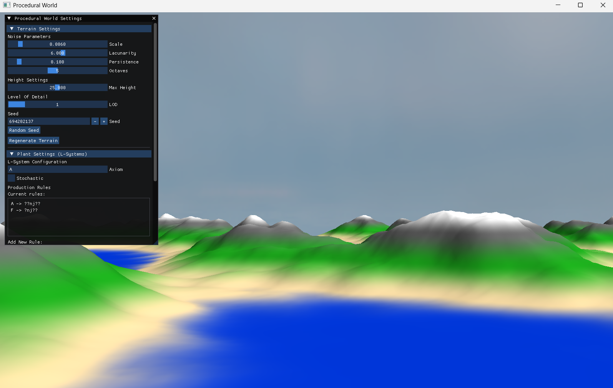
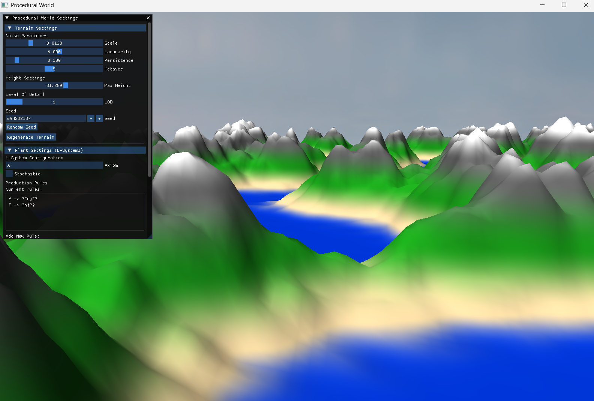
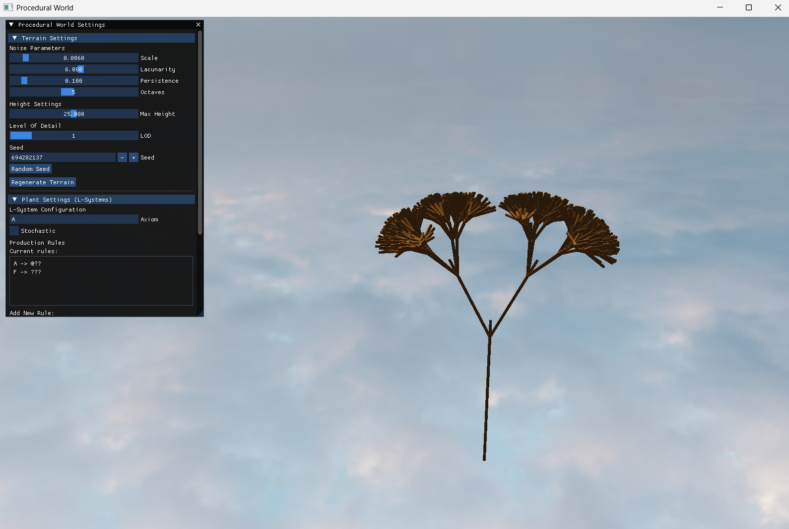
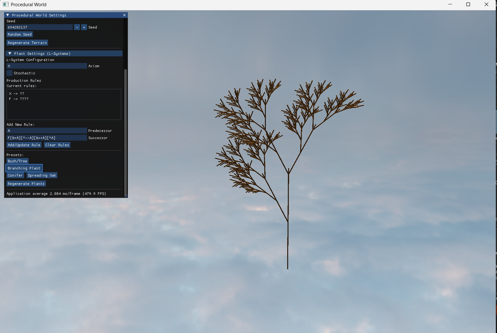
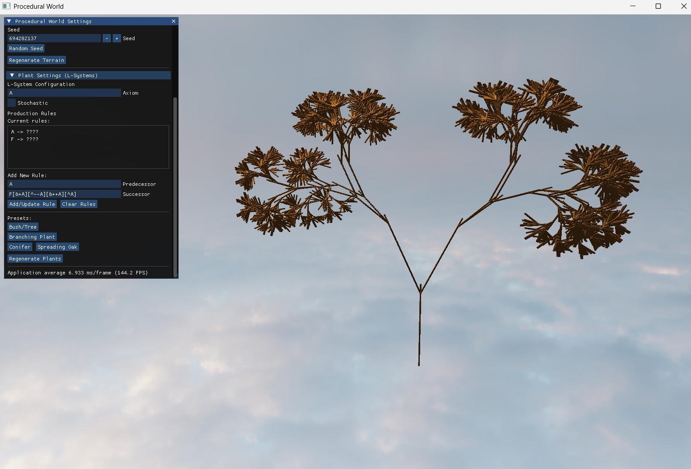

# ProceduralWorlds

## Key Features

Infinite procedural world generation based on Perlin noise and L-systems, implemented in OpenGL.

The terrain is divided into chunks. Only the chunks surrounding the player are generated and rendered, allowing the world to appear infinite while keeping performance under control.

Users can modify L-system parameters to experiment with different axioms and production rules and observe how they affect vegetation generation.

L-systems are implemented using a turtle interpreter. Starting from an initial axiom, production rules are applied iteratively to generate a string, which is then interpreted by the turtle to construct vegetation geometry.

Terrain chunk stitching is handled by a compute shader. It processes chunk boundaries and averages normals to ensure smooth transitions between neighboring chunks.

A compute shader is also responsible for the initial blinking effect during world generation at application startup.

Shaders are used to define different “biomes” in the world. Currently, biomes do not affect terrain generation.

It is possible to generate forests using L-systems, but this is not recommended due to performance limitations (to test it, uncomment line 18 in `chunk_manager.cpp`).  
Forests are generated on the CPU and then uploaded to the GPU, which is suboptimal. Moving this process fully to the GPU is planned for future development.

LOD (Level of Detail) is implemented for terrain, but not for vegetation. LOD settings can be adjusted in the GUI. Currently, the system does not fully take distance into account.

---

## Technical Stack

- **Language:** C++  
- **Graphics API:** OpenGL  
- **Windowing:** GLFW  
- **Mathematics:** GLM  
- **Build System:** CMake  
- **GUI:** ImGui  

---

## Media

  
  
  
  
  

---

## Controls

- **W / A / S / D** – Move forward, left, backward, and right  
- **Mouse movement** – Look around  
- **Tab** – Toggle GUI  
- **ESC** – Exit the application  

---

## GUI

The GUI can be toggled with the Tab key. It allows you to adjust terrain generation settings as well as L-system parameters.

---

## Getting Started (CMake)

1. Clone the repository.  
2. Create a build directory and configure the project:

```bash
mkdir build
cd build
cmake ..
cmake --build . --config Release

3. You will find the executable in the build/Release folder. Run it to explore the procedural world!

## Visual studio
1. Clone the repository.
2. Open folder in visual studio
3. Visual studio will automatically generate the build files. Build the solution in Release mode.
